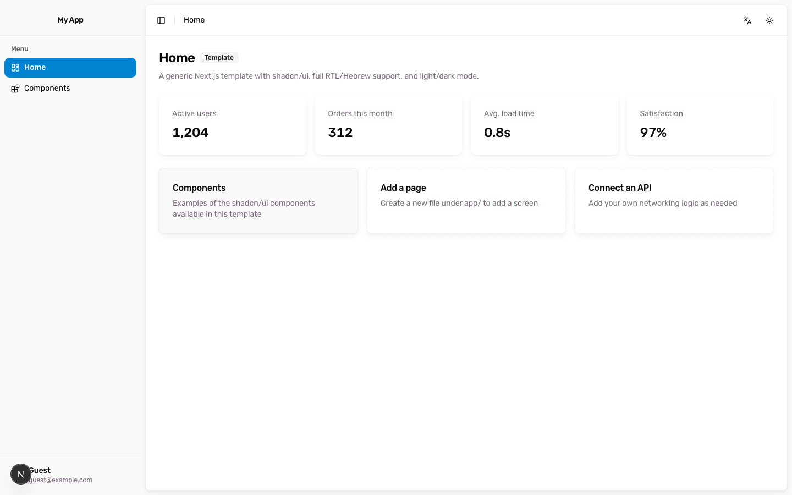

<div align="center">

# nio

Next.js App Router starter with shadcn/ui, Hebrew/English i18n, and full RTL.  
Ship the app as a template, or pull pieces through the `@netanelio` registry.

<br />

[](https://github.com/Netanelshoshan/nio/actions/workflows/ci.yml)
[](https://nextjs.org)
[](https://ui.shadcn.com)
[](https://tailwindcss.com)
[](https://www.typescriptlang.org)
[](https://github.com/Netanelshoshan/nio)

</div>

<p align="center">
  
</p>

## Install

Add the registry once, then install items by name:

```bash
npx shadcn@latest registry add @netanelio=https://registry.netanel.io/r/{name}.json
npx shadcn@latest add @netanelio/i18n
npx shadcn@latest add @netanelio/theme
npx shadcn@latest add @netanelio/app-shell
```

Or install straight from GitHub:

```bash
npx shadcn@latest add Netanelshoshan/nio/i18n
npx shadcn@latest add Netanelshoshan/nio/theme
npx shadcn@latest add Netanelshoshan/nio/app-shell
```

| Item | Type | Installs |
| --- | --- | --- |
| `i18n` | item | Locale routing, dictionaries, RTL helpers, language switcher |
| `theme` | component | `ThemeProvider` and light / dark / system toggle |
| `app-shell` | block | Sidebar, header, page wrapper, brand mark |

```bash
npx shadcn@latest list @netanelio
npx shadcn@latest view @netanelio/i18n
```

## What’s in the app

- **App shell** — collapsible sidebar and header in `app/[lang]/layout.tsx`. Sidebar side flips in RTL.
- **Routes** — `/he`, `/en`, `/he/components`, `/en/components`. `/` follows `Accept-Language` (Hebrew default).
- **i18n** — dictionaries in `dictionaries/`, negotiation in `proxy.ts`, `LocaleSwitcher` keeps the current path.
- **Theme** — `next-themes`, `d` toggles light/dark when you are not typing.
- **Gallery** — `/components` shows every installed shadcn/ui primitive, localized.

Add a page under `app/[lang]/` and a matching entry in `navItems` inside `components/app-sidebar.tsx`.

## Local

```bash
npm install
npm run dev
```

| Script | What it does |
| --- | --- |
| `npm run dev` | Next.js dev server |
| `npm run build` | Production build |
| `npm run lint` | ESLint |
| `npm run typecheck` | `tsc --noEmit` |
| `npm run registry:validate` | Validate `registry.json` |
| `npm run registry:build` | Write static JSON to `public/r` |
